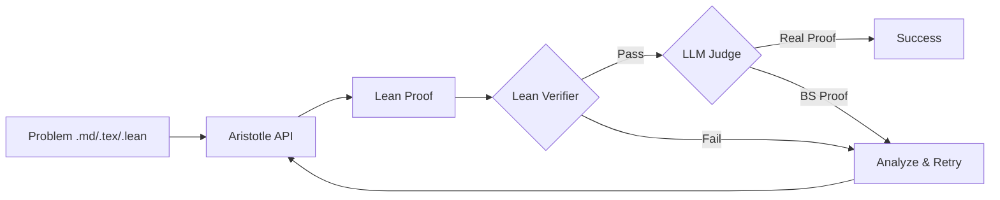

# Erdos

Automated theorem proving pipeline using Aristotle API with Lean 4 verification.

## Setup

```bash
pip install -e .
```

Set environment variables (or create `.env`):
```
ARISTOTLE_API_KEY=your_key
ANTHROPIC_API_KEY=your_key  # optional, for LLM judge
```

## Usage

### Generate a proof
```bash
erdos prove problems/triangle_tiling.md --proof "Use grid subdivision"
```

### Verify a Lean file
```bash
erdos check solutions/triangle_tiling/TriangleTiling.lean
```

### Batch process
```bash
erdos batch problems/ --pattern "*.md"
```

### Show config
```bash
erdos config
```

## CLI Options

```
erdos prove <file> [options]
  -p, --proof         Proof hint
  -c, --context       Context files
  -n, --max-iterations   Max attempts (default: 5)
  --no-verify         Skip Lean verification

erdos check <file>    Verify Lean proof locally
erdos batch <folder>  Process multiple problems
erdos config          Show configuration
```

## Structure



## Project Layout

```
problems/        # Input problems
solutions/       # Generated proofs
src/erdos/       # Python pipeline
Erdos/           # Lean library
```

## Lean

Build all:
```bash
lake build
```

Build specific:
```bash
lake build solutions.triangle_tiling.TriangleTiling
```
