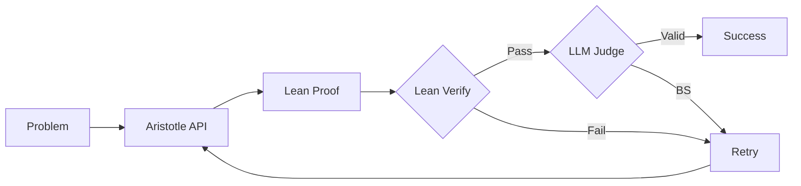

# Erdős

Automated theorem proving pipeline using Aristotle API with Lean 4 verification.

## Setup

```bash
pip install -e .
lake update  # fetch Mathlib
```

Create `.env`:
```
ARISTOTLE_API_KEY=your_key
ANTHROPIC_API_KEY=your_key  # for LLM judge
```

## Usage

```bash
# Prove a Lean problem with hints
erdos prove problems/lean/erdos_85.lean --context problems/hints/erdos_85_hint.md

# Prove a markdown problem
erdos prove problems/markdown/triangle_tiling.md

# Verify locally
erdos check solutions/example_problem/SumFirstN.lean

# Skip Lean verification
erdos prove problems/markdown/triangle_tiling.md --no-verify
```

## Project Layout

```
problems/
├── lean/        # Formal Lean problem statements
├── markdown/    # Informal problem descriptions
└── hints/       # Proof hints and notes
solutions/       # Generated proofs
src/erdos/       # Python pipeline
Erdos/           # Lean library
```

## Pipeline



## Lean

```bash
lake build                    # build all
lake build Erdos              # build library
lake build solutions          # build solutions
```
